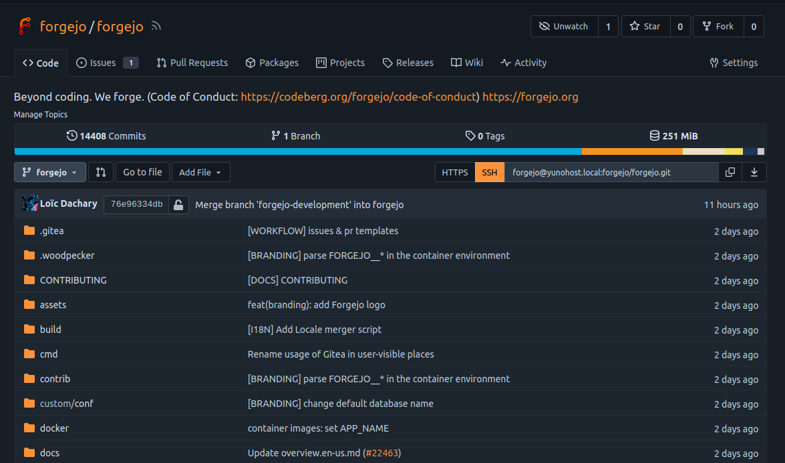

<!--
N.B.: This README was automatically generated by https://github.com/YunoHost/apps/tree/master/tools/README-generator
It shall NOT be edited by hand.
-->

# Forgejo pour YunoHost

[](https://dash.yunohost.org/appci/app/forgejo)  

[](https://install-app.yunohost.org/?app=forgejo)

*[Read this readme in english.](./README.md)*

> *Ce package vous permet d’installer Forgejo rapidement et simplement sur un serveur YunoHost.
Si vous n’avez pas YunoHost, regardez [ici](https://yunohost.org/#/install) pour savoir comment l’installer et en profiter.*

## Vue d’ensemble

Forgejo is a self-hosted lightweight software forge. Easy to install and low maintenance, it just does the job.

Brought to you by an inclusive community under the umbrella of Codeberg e.V., a democratic non-profit organization, Forgejo can be trusted to be exclusively Free Software. It is a "soft" fork of Gitea with a focus on scaling, federation and privacy. 

### Features

- User dashboard, user profile and activity timeline.
- User, organization and repository management.
- Repository and organization webhooks, including Slack, Discord and Dingtalk.
- Repository Git hooks, deploy keys and Git LFS.
- Repository issues, pull requests, wiki, protected branches and collaboration.
- Migrate and mirror repositories with wiki from other code hosts.
- Web editor for quick editing repository files and wiki.
- Jupyter Notebook and PDF rendering.
- Authentication via SMTP, LDAP.
- Customize HTML templates, static files and many others.


**Version incluse :** 1.18.5-0~ynh5

## Captures d’écran



## Avertissements / informations importantes

## Additional informations

### Notes on SSH usage

If you want to use Forgejo with SSH and be able to pull/push with your SSH key, your SSH daemon must be properly configured to use private/public keys. Here is a sample configuration `/etc/ssh/sshd_config` that works with Forgejo:

```bash
PubkeyAuthentication yes
ChallengeResponseAuthentication no
PasswordAuthentication no
```

You must also add your public key to your Forgejo profile.

When using SSH on any port other than 22, you need to add these lines to your SSH configuration `~/.ssh/config`:

```bash
Host domain.tld
    port 2222 # change this with the port you use
```

### Private Mode

Actually it's possible to access to the Git repositories by the `git` command over HTTP also in private mode installation. It's important to know that in this mode the repository could be ALSO getted if you don't set the repository as private in the repos settings.

### Remove

To remove the data directory in `/home/yunohost.app/forgejo`, use the `--purge` option:
`sudo yunohost remove forgejo --purge`.

### Uploaded files size
By default, NGINX is configured with a maximum value for uploading files at 200 MB. It's possible to change this value on `/etc/nginx/conf.d/my.domain.tld.d/forgejo.conf`.
```
client_max_body_size 200M;
```
Don't forget to restart Forgejo `sudo systemctl restart forgejo.service`.

> These settings are restored to the default configuration when updating Forgejo. Remember to restore your configuration after all updates.

### Git command access with HTTPS

If you want to use the Git command (like `git clone`, `git pull`, `git push`), you need to set this app as **public**.


## Documentations et ressources

* Site officiel de l’app : <https://forgejo.org>
* Documentation officielle de l’admin : <https://docs.gitea.io/>
* Dépôt de code officiel de l’app : <https://codeberg.org/forgejo/forgejo>
* Documentation YunoHost pour cette app : <https://yunohost.org/app_forgejo>
* Signaler un bug : <https://github.com/YunoHost-Apps/forgejo_ynh/issues>

## Informations pour les développeurs

Merci de faire vos pull request sur la [branche testing](https://github.com/YunoHost-Apps/forgejo_ynh/tree/testing).

Pour essayer la branche testing, procédez comme suit.

``` bash
sudo yunohost app install https://github.com/YunoHost-Apps/forgejo_ynh/tree/testing --debug
ou
sudo yunohost app upgrade forgejo -u https://github.com/YunoHost-Apps/forgejo_ynh/tree/testing --debug
```

**Plus d’infos sur le packaging d’applications :** <https://yunohost.org/packaging_apps>