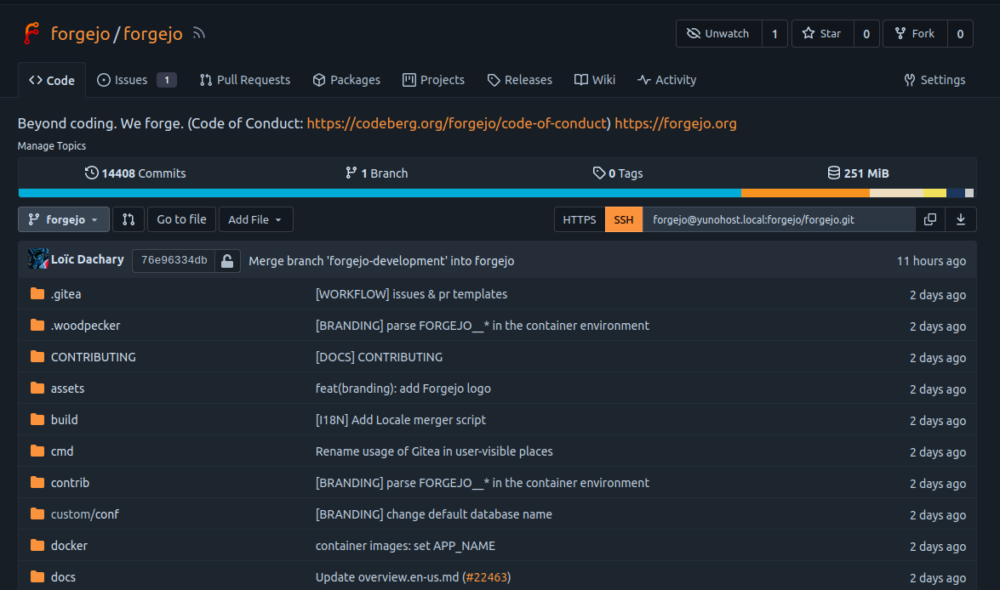

<!--
NOTA: Este README foi creado automáticamente por <https://github.com/YunoHost/apps/tree/master/tools/readme_generator>
NON debe editarse manualmente.
-->

# Forgejo para YunoHost

[](https://dash.yunohost.org/appci/app/forgejo)  

[](https://install-app.yunohost.org/?app=forgejo)

*[Le este README en outros idiomas.](./ALL_README.md)*

> *Este paquete permíteche instalar Forgejo de xeito rápido e doado nun servidor YunoHost.*  
> *Se non usas YunoHost, le a [documentación](https://yunohost.org/install) para saber como instalalo.*

## Vista xeral

Forgejo is a self-hosted lightweight software forge. Easy to install and low maintenance, it just does the job.

Brought to you by an inclusive community under the umbrella of Codeberg e.V., a democratic non-profit organization, Forgejo can be trusted to be exclusively Free Software. It focuses on security, scaling, federation and privacy. 

### Features

- User dashboard, user profile and activity timeline.
- User, organization and repository management.
- Repository and organization webhooks, including Slack, Discord and Dingtalk.
- Repository Git hooks, deploy keys and Git LFS.
- Repository issues, pull requests, wiki, protected branches and collaboration.
- Migrate and mirror repositories with wiki from other code hosts.
- Web editor for quick editing repository files and wiki.
- Jupyter Notebook and PDF rendering.
- Authentication via SMTP, LDAP.
- Customize HTML templates, static files and many others.


**Versión proporcionada:** 7.0.1~ynh1

## Capturas de pantalla



## Documentación e recursos

- Web oficial da app: <https://forgejo.org>
- Documentación oficial para usuarias: <https://forgejo.org/docs/latest/user/>
- Documentación oficial para admin: <https://forgejo.org/docs/latest/admin/>
- Repositorio de orixe do código: <https://codeberg.org/forgejo/forgejo>
- Tenda YunoHost: <https://apps.yunohost.org/app/forgejo>
- Informar dun problema: <https://github.com/YunoHost-Apps/forgejo_ynh/issues>

## Info de desenvolvemento

Envía a túa colaboración á [rama `testing`](https://github.com/YunoHost-Apps/forgejo_ynh/tree/testing).

Para probar a rama `testing`, procede deste xeito:

```bash
sudo yunohost app install https://github.com/YunoHost-Apps/forgejo_ynh/tree/testing --debug
ou
sudo yunohost app upgrade forgejo -u https://github.com/YunoHost-Apps/forgejo_ynh/tree/testing --debug
```

**Máis info sobre o empaquetado da app:** <https://yunohost.org/packaging_apps>
