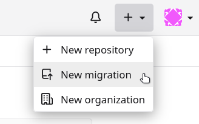

## Additional informations

### User synchronization
In order to allow access to Forgejo admin section, YunoHost users are automaticaly synchronized with Forgejo's.  
You can use «Forgejo (admin)» permission to manage which user is considered as forgejo admin.

The «forgejo (api)» permission must be set to «Visitors» group to allow user synchronization via an API call.

**Known issue** : when a user is added to a group (e.g. the one with «Forgejo (admin)» permission), the synchronization is not triggered by YunoHost. You have to update a user (without any modification) to trigger it. (https://github.com/YunoHost/issues/issues/2213)

### Notes on SSH usage

If you want to use Forgejo with SSH and be able to pull/push with your SSH key, your SSH daemon must be properly configured to use private/public keys. Here is a sample configuration `/etc/ssh/sshd_config` that works with Forgejo:

```bash
PubkeyAuthentication yes
ChallengeResponseAuthentication no
PasswordAuthentication no
```

You must also add your public key to your Forgejo profile.

When using SSH on any port other than 22, you need to add these lines to your SSH configuration `~/.ssh/config`:

```bash
Host domain.tld
    port 2222 # change this with the port you use
```

### Private Mode

Actually it's possible to access to the Git repositories by the `git` command over HTTP also in private mode installation. It's important to know that in this mode the repository could be ALSO getted if you don't set the repository as private in the repos settings.

### Uploaded files size
By default, NGINX is configured with a maximum value for uploading files at 200 MB. It's possible to change this value on `/etc/nginx/conf.d/my.domain.tld.d/forgejo.conf`.
```
client_max_body_size 200M;
```
Don't forget to restart Forgejo `sudo systemctl restart forgejo.service`.

> These settings are restored to the default configuration when updating Forgejo. Remember to restore your configuration after all updates.

### Git command access with HTTPS

If you want to use the Git command (like `git clone`, `git pull`, `git push`), you need to set this app as **public**.

## Migrating from gitea

> [!NOTE]
> Fully automated migration from the gitea package is not yet supported. Repositories need to be migrated individually.

Before migrating any repositories, you need to:

### Setting up forgejo

> [!WARNING]
> forgejo needs to be setup on a different domain than gitea.

If you'd like to keep your repository URLs, you need to change the URL that the gitea application uses. But because of a URL conflict (both apps claim `DOMAIN/v2`), you need to move the existing gitea app to a different domain.

Once that is done, you can proceed with setting up forgejo. Make sure group synchronization is enabled in the forgejo settings. Now, from the forgejo admin interface, click the « Synchronize external user data » to create the forgejo users from Yunohost users.

### Creating a gitea access key

From your gitea personal account, go to *Settings*, then *Applications* in the sidebar. Click *Generate new token* with any name (eg. `forgejo`), then make sure *Repository and Organization access* is set to `All`, and set all permissions to `Read`.

Now click *Generate token*, and copy the token printed on screen. You will need it later for each migration.

### Migrating a repository manually

> [!WARNING]
> You can only migrate a repository to your own account or an organization you're a member of. Each user will have to migrate their own repositories.

Once connected on forgejo, click the *New migration* button in the action bar in the top-right corner:



Now select *Gitea*, then:

- write your changed gitea repository URL: `https://NEWGITEA.example.com/gitea/USER/REPOSITORY`
- write your gitea access token
- check all the boxes in *Migration items* so issues/PRs are also migrated
- select yourself or your organization as owner of the  newrepository
- write the repository name
- check *Make repository private* if the repository was previously private

Now you can click *Migrate repository* and the whole repository will be imported to forgejo.
